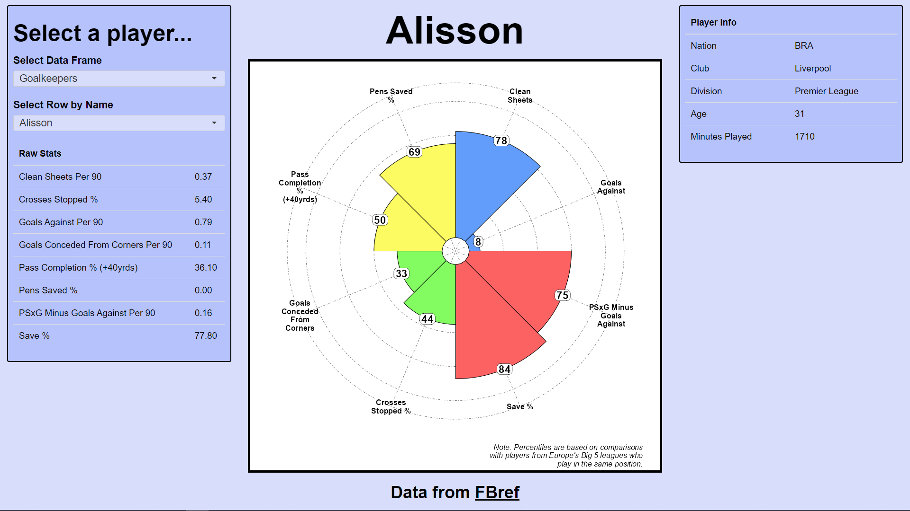
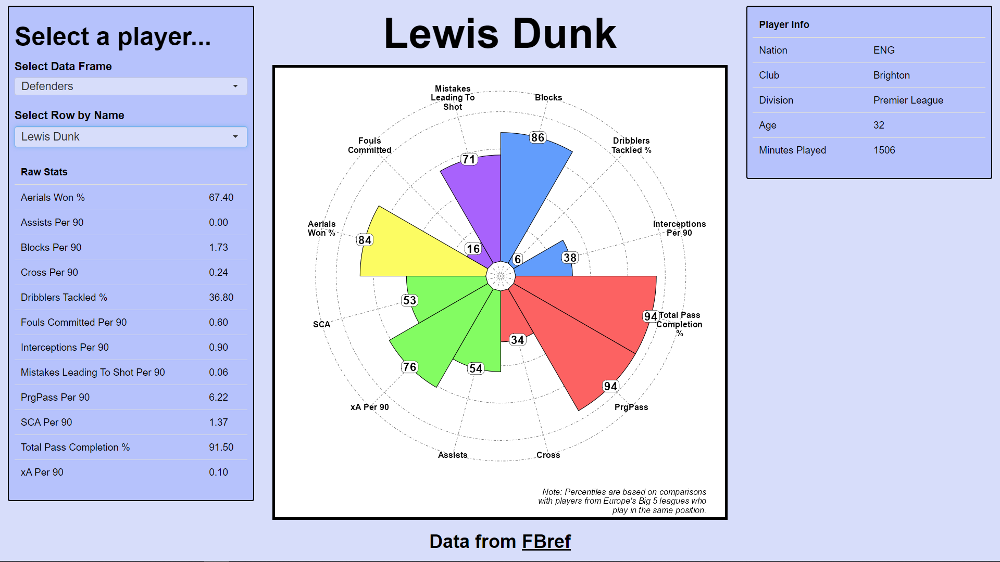
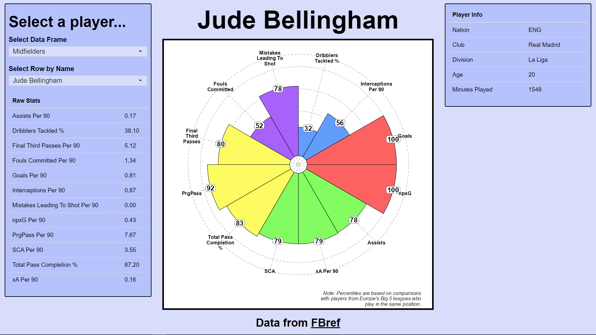
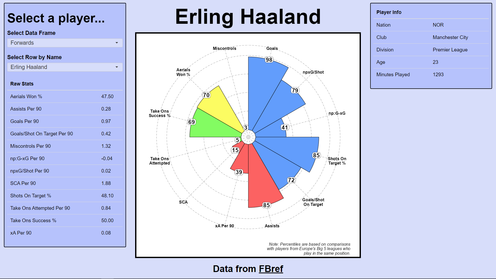

# making-percentile-radars
Files used in my "making percentile radars" project.

In this project, I'm using data from <a href="https://fbref.com/en/">fbref</a> to create "percentile radars" for male football players in Europe's "Big 5" leagues for the current season. Percentile radars display percentile information for some set of variables, similar to a bar chart but presented radially. To display these radars, I have produced a dashboard using the <a href="https://shiny.posit.co/r/getstarted/shiny-basics/lesson1/index.html">Shiny package in R</a> where users can select any male player they want from Europe's "Big 5" leagues and see their live percentile data (compared against players playing in the same position as them).

Here's are some examples of what the dashboard looks like currently (as of 

):

 </img>
 </img>
 </img>
 </img>

I may come back to this project again in the future to make additions/changes to the dashboard, but I wanted to get this out into the public domain for others to see. I had a lot of fun working on this project and I feel a lot more comfortable and experienced with the data collection, cleaning and dashboarding pipeline and feel this experience puts me in a much better position to create even more powerful dashboards and work with more complex data in the future.

 This work is licensed under a <a rel="license" href="http://creativecommons.org/licenses/by/4.0/">Creative Commons Attribution 4.0 International License</a>.
